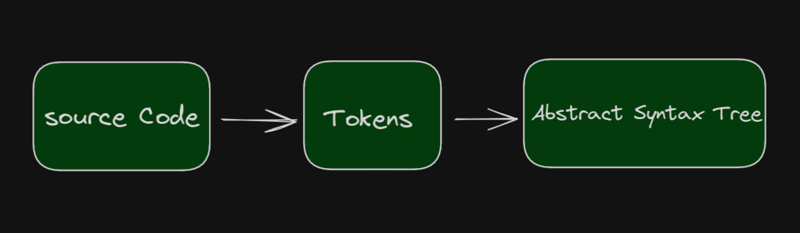
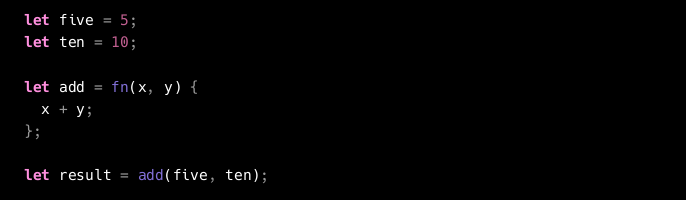

# LEXING

## Lexical Analysis

- the first transformation, from source code to tokens is called lexical analysis
- it's done by lexer also called as tokenizer or scanner
- tokens itself are small, easliy categorizable data structures that are fed to the parser
- the parser then uses them to build up the AST(abstract syntax tree)



- whitespace characters don't show up as tokens

## Defining Tokens

- numbers are just numbers
- variable names are "identifiers"
- other words which look like identifiers but aren't really identifiers since they are part of the language itself are called "keywords"
- symbols like +, -, *, /, (, ), {, }, etc. are called "special characters"



- IILEGAL token is used to represent a token that the lexer doesn't know about
- EOF token is used to indicate that we've reached the end of the input (tells parser to stop later on)

## Lexing in monkey

- we'll use the following data structures to represent tokens

```go
type TokenType string

type Token struct {
    Type TokenType
    Literal string
}
```

- we'll use the following constants to represent the different token types

```go
const (
    ILLEGAL = "ILLEGAL"
    EOF = "EOF"

    // Identifiers + literals
    IDENT = "IDENT" // add, foobar, x, y, ...
    INT = "INT" // 1343456

    // Operators
    ASSIGN = "="
    PLUS = "+"

    // Delimiters
    COMMA = ","
    SEMICOLON = ";"

    LPAREN = "("
    RPAREN = ")"
    LBRACE = "{"
    RBRACE = "}"

    // Keywords
    FUNCTION = "FUNCTION"
    LET = "LET"
)
```

## Different Tokens

### Integers
- INT: integers

### Operators
- ASSIGN: =
- PLUS: +
- COMMA: ,
- SEMICOLON: ;
- LPAREN: (
- RPAREN: )
- LBRACE: {
- RBRACE: }

### double character tokens
- EQ: ==
- NOT_EQ: !=

### Keywords
- FUNCTION: FUNCTION
- LET: LET
- TRUE: TRUE
- FALSE: FALSE
- IF: IF
- ELSE: ELSE
- RETURN: RETURN

### Identifiers and literals
- IDENT: add, foobar, x, y, ...

# Conclusion for lexer

## whats an lexer?
- a lexer is a program that takes a stream of characters as input and produces a stream of tokens as output

## whats a token?
- a token is a pair consisting of a token type and a literal value

## whats a token type?
- a token type is a string that identifies the type of the token

## whats a literal value?
- a literal value is the actual value of the token as it appears in the source code

## whats the difference between a token type and a literal value?
- a token type is a category of tokens, e.g. keywords, identifiers, operators, etc.

## whats the difference between a token and a token type?
- a token is a pair consisting of a token type and a literal value

## whats the difference between a lexer and a parser?
- a lexer takes a stream of characters and produces a stream of Tokens
- a parser takes a stream of Tokens and produces a data structure, e.g. an AST


