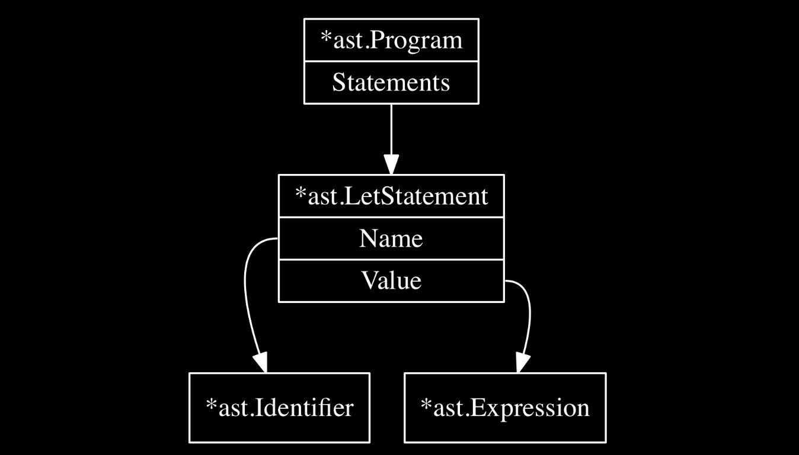

# Parsing

## Parsers

A Parser is a software component that takes input data (frequetly text) and builds a data structure.
often some kind of parse tree, abstract syntax tree or other hierarchical structure

Parsers take source code as input (either as text or tokens) and produces a data structure which
represents the source code. the process of prarsing is also called as syntactic analysis.

## Parser Generators

Parser generators are tools, when fed with a formal description of a language, produce parsers as their output.
This output is code that can be compiled/interpreted and itself fed into source code as input to produce a syntax tree.

There are a lot of parser generators, differing in the format of the input language, the type of parser generated,
Majority of parser generators are based on the formalism of context-free grammars.

A CFG is a set of rules that describe how to form correct (valid syntax) sentences in a language. Most common notationial
formats of CFGs are Backus-Naur Form(BNF) or the extended Backus-Naur Form (EBNF).

## Parsers

There are two types of parsers:

- Top-down Parsers
- Bottom-up Parsers

### Top-down Parsers

1. Recursive descent parsers
2. Earley parsers
3. Predictive parsers

### Bottom-up Parsers

1. LR Parsers
2. LALR parsers
3. GLR parsers

### AST Tree

